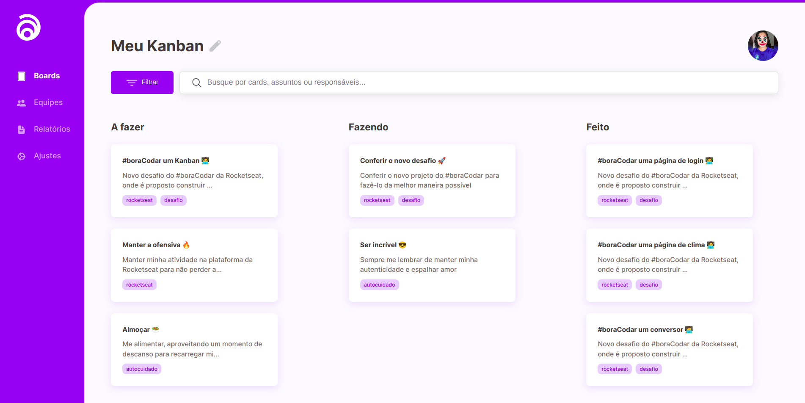

  <a href="#-tecnologias">Tecnologias</a>&nbsp;&nbsp;&nbsp;|&nbsp;&nbsp;&nbsp;
  <a href="#-projeto">Projeto</a>&nbsp;&nbsp;&nbsp;|&nbsp;&nbsp;&nbsp;
  <a href="#-como-rodar">Como rodar</a>&nbsp;&nbsp;&nbsp;|&nbsp;&nbsp;&nbsp;
  <a href="#-como-contribuir">Como contribuir</a>&nbsp;&nbsp;&nbsp;
  

 

  

## Kanban Interface

## 🚀 Tecnologias

Esse projeto foi desenvolvido com as seguintes tecnologias:

- [HTML5](https://developer.mozilla.org/pt-BR/docs/Web/HTML)
- [CSS3](https://developer.mozilla.org/pt-BR/docs/Web/CSS)
- [JavaScript](https://developer.mozilla.org/pt-BR/docs/Web/JavaScript)

## 💻 Projeto

Projetos #boraCodar da [Rocketseat](https://boracodar.dev/).

<table>
  <thead>
    <tr>
      <th>#</th>
      <th>name</th>
      <th>date</th>
      <th>view</th>
    </tr>
  </thead>
  <tbody>
    <tr>
      <td>01</td>
      <td>Music Player</td>
      <td>11/01/23</td>
      <td><a href="https://github.com/leticea/music-player">🔗</a></td>
    </tr>
    <tr>
      <td>02</td>
      <td>Product Card</td>
      <td>18/01/23</td>
      <td><a href="https://github.com/leticea/product-card">🔗</a></td>
    </tr>
    <tr>
      <td>04</td>
      <td>Chat</td>
      <td>01/02/23</td>
      <td><a href="https://github.com/leticea/chat-rocketseat">🔗</a></td>
    </tr>
    <tr>
      <td>05</td>
      <td>Calculator</td>
      <td>08/02/23</td>
      <td><a href="https://github.com/leticea/calculator-rocketseat">🔗</a></td>
    </tr>
    <tr>
      <td>06</td>
      <td>Boarding Pass</td>
      <td>15/02/23</td>
      <td><a href="https://github.com/leticea/boarding-pass">🔗</a></td>
    </tr>
    <tr>
      <td>07</td>
      <td>Find Carnival Blocks</td>
      <td>22/02/23</td>
      <td><a href="https://github.com/leticea/find-carnival-blocks">🔗</a></td>
    </tr>
    <tr>
      <td>08</td>
      <td>Dashboard</td>
      <td>01/03/23</td>
      <td><a href="https://github.com/leticea/dashboard">🔗</a></td>
    </tr>
    <tr>
      <td>09</td>
      <td>Currency Converter</td>
      <td>08/03/23</td>
      <td><a href="https://github.com/leticea/currency-converter">🔗</a></td>
    </tr>
    <tr>
      <td>10</td>
      <td>Weather Page</td>
      <td>15/03/23</td>
      <td><a href="https://github.com/leticea/weather-page">🔗</a></td>
    </tr>
    <tr>
      <td>11</td>
      <td>Login Screen</td>
      <td>22/03/23</td>
      <td><a href="https://github.com/leticea/login-screen">🔗</a></td>
    </tr>
  </tbody>
</table>

## 🚀 Como Rodar

- Clone o projeto.
- Entre no repositório e clique duas vezes no arquivo index.html.

## 🤔 Como contribuir

- Faça um fork desse repositório;
- Cria uma branch com a sua feature: `git checkout -b minha-feature`;
- Faça commit das suas alterações: `git commit -m 'feat: Minha nova feature'`;
- Faça push para a sua branch: `git push origin minha-feature`.

Depois que o merge da sua pull request for feito, você pode deletar a sua branch.

## 📝 Licença

Esse projeto está sob a licença MIT.
